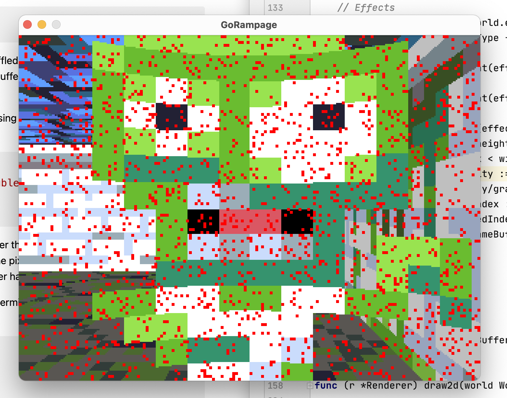

# GoRampage
RetroRampage Tutorial Series for Go

Learning Go by following https://github.com/nicklockwood/RetroRampage and implement it in Go instead of Swift.

~~Decided to use https://github.com/gonutz/prototype 2D Prototype Gaming Framework because it seems to be simple enough~~

Switched to ebiten https://github.com/hajimehoshi/ebiten as it allows to more closely replicate the original raycast implementation.

## Installation

* `go get github.com/baumhoto/GoRampage`

* `cd {YOUR_GO_PATH}/src/github.com/baumhoto/GoRampage`

* `go build`

* `./GoRampage`

## Controls

ESC - Quit
P   - Pause
R   - Reset Level
Arrow-Keys - Movement
WSAD - Movement
SPACE - Fire
